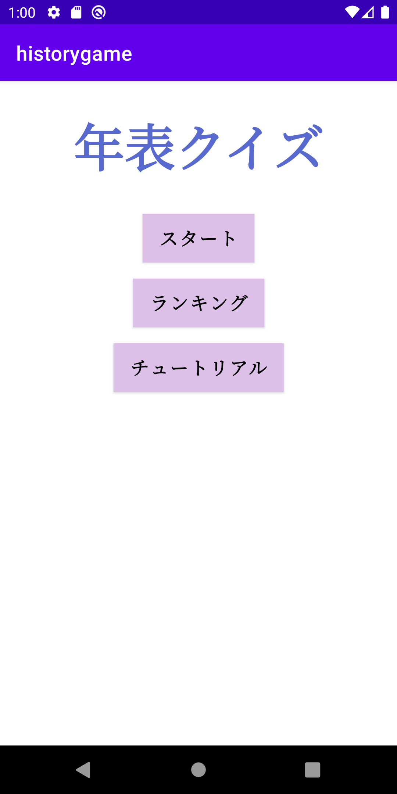
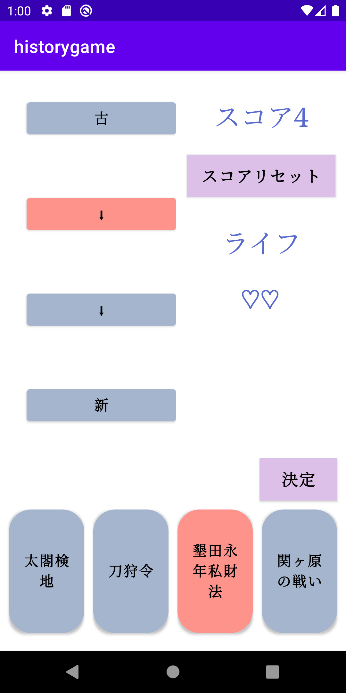
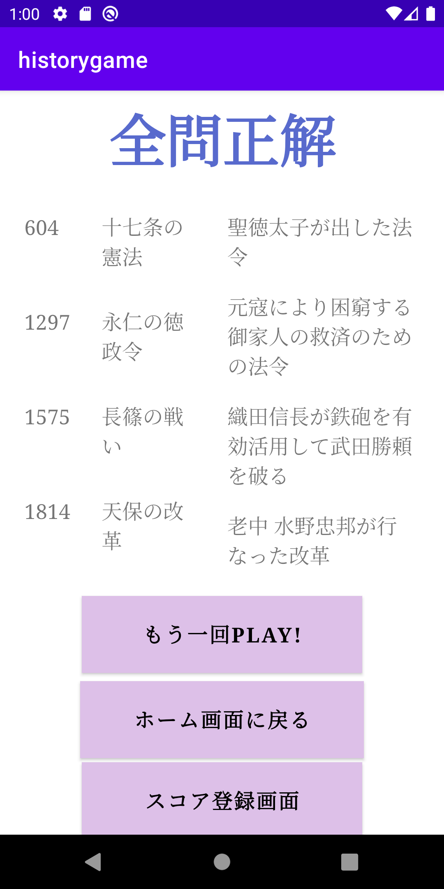
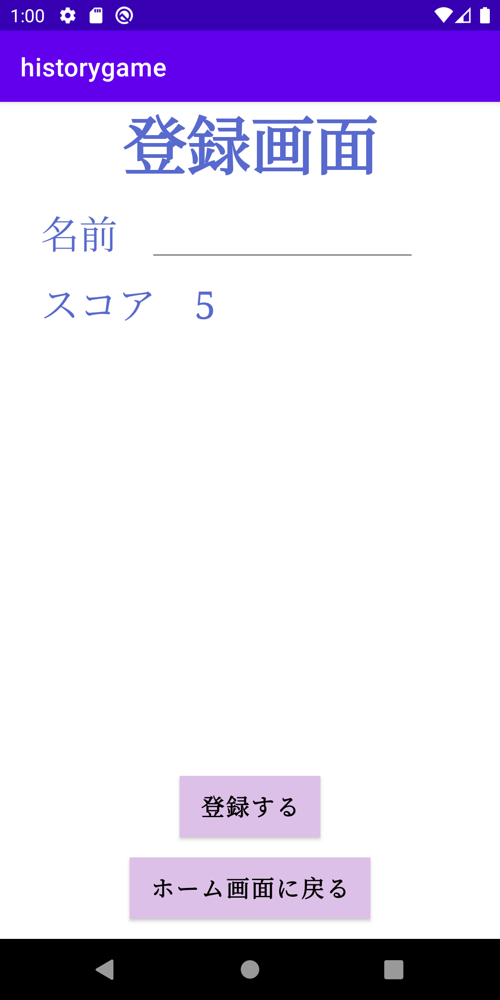

# History Game（ヒストリーゲーム）

## 概要
「History Game」は、歴史の年表の並び替えをテーマにしたクイズ形式のAndroidアプリです。  
自分自身が年表の出来事を正しい順番に並べることを苦手としていた経験から、  
ゲーム感覚で繰り返し練習できるアプリとして制作しました。

## 制作背景
歴史の学習では、出来事を暗記するだけでなく、  
年代や流れを理解することが重要だと感じていました。  
特に年表の並び替えは苦手意識を持ちやすいため、  
遊びながら自然に順序を覚えられる仕組みを作りたいと考え、制作しました。

## 主な機能・特徴
- 歴史に関するクイズを出題するゲーム形式
- シンプルで直感的に操作できるUI
- 繰り返し遊べる設計

## 使用技術
- Android Studio  
- Java

 ## スクリーンショット

## APKダウンロード
APKファイルは以下の **Releases** ページからダウンロードできます。

👉 https://github.com/Nanami-Matsui/historygame/releases

